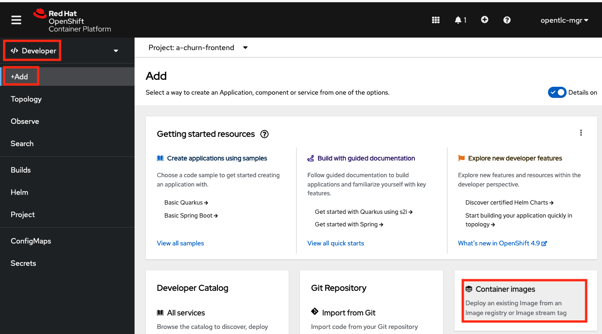
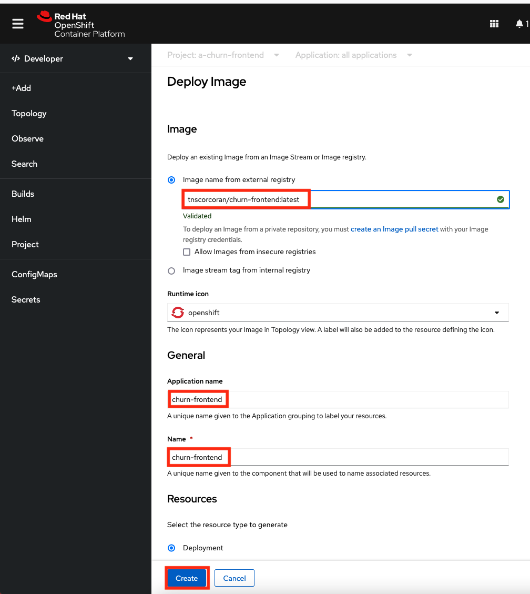
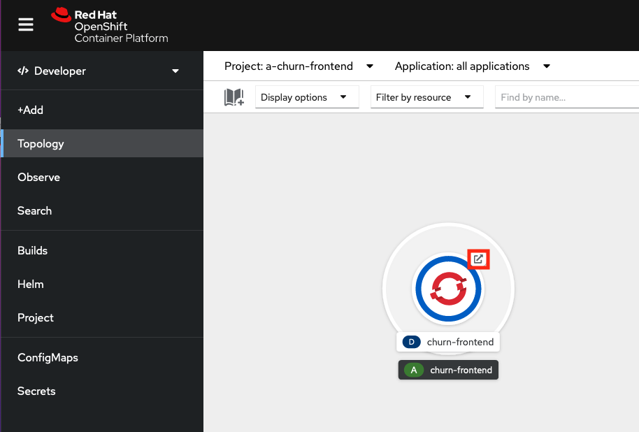
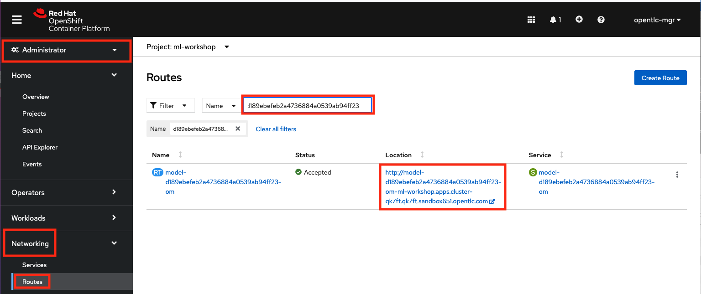
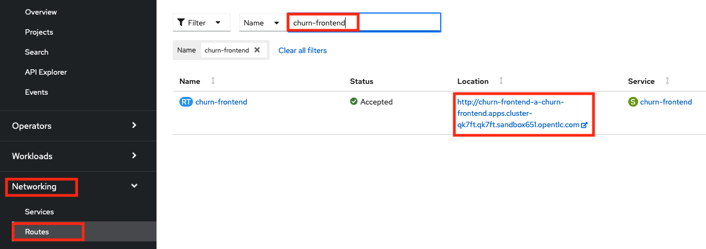
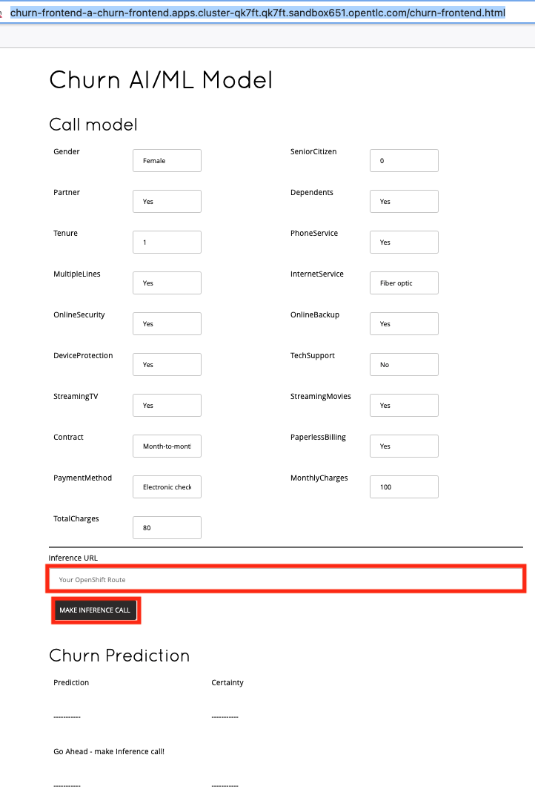
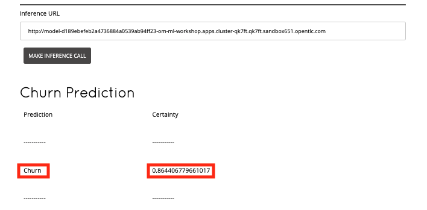

# Churn AI/ML Demo Front End

Based on Quarkus guide: https://quarkus.io/guides/rest-json

A front end for https://github.com/odh-labs/ml-workshop

-----------------------------

### PACKAGING/RUNNING INSTRUCTIONS

```
mvn package

./mvnw quarkus:dev

localhost:8080/churn-frontend.html
```

-----------------------------

### CONTAINERISING INSTRUCTIONS

I'm using src/main/docker/Dockerfile.jvm as my Dockerfile. Rename yours as approprate


Sample packaging instructions. Using docker - alternatively use podman. Enter your credentials for your desired registry.
```
mvn package
docker login

docker build -f src/main/docker/Dockerfile -t your-docker-repo/churn-frontend:latest .
docker tag your-docker-repo/churn-frontend:latest your-docker-repo/churn-frontend:latest
docker push your-docker-repo/churn-frontend:latest
```


-----------------------------

### RUNNING INSTRUCTIONS - USING RED HAT OPENSHIFT

For convenience, I've added this repo to Dockerhub under this repository tag __tnscorcoran/churn-frontend:latest__

In OpenShift, in Developer perspective, click __Add__ and select __Container Images__
  

You'll see a screen like this. Under Image Name , enter 
__*tnscorcoran/churn-frontend:latest*__

Then set your __Application Name__ and __Name__ to __*churn-frontend*__
Go with the rest of the defaults and click __Create__
  

A couple of minutes later, the circle should be dark blue - indicating it's deployed. 

  

Hit the route button as shown and append  __*churn-frontend.html*__ to the tab that opens our your browser. In my case the full URL is

```
http://churn-frontend-a-churn-frontend.apps.cluster-qk7ft.qk7ft.sandbox651.opentlc.com/churn-frontend.html

```

---------------------------------------------------------------------------------------------------------

### NOTE - in the actual Churn Instructions, the following should be for the students; before here should be in the setup instructions


Before making an inference call to our model, you'll need to get *your inference URL*. In OpenShift, __open the Administrator perspective__ then __move to Networking > Routes__. In the filter box, enter your experiment ID from the experiment you registered in  __*ML FLOW*__  earlier. Copy the URL under *Location*. That's *your inference URL*. 
  


In OpenShift, __open the Administrator perspective__ then __move to Networking > Routes__ and filter on __*churn-frontend*__
  

Hit the route button as shown and append  __*churn-frontend.html*__ to the tab that opens our your browser. In my case the full URL is

```
http://churn-frontend-a-churn-frontend.apps.cluster-qk7ft.qk7ft.sandbox651.opentlc.com/churn-frontend.html

```
Open it and you'll see a screen like this:
  

In the large textbox, enter *your inference URL* that you got a couple of steps back. Click __MAKE INFERENCE CALL__. Shortly, the page will show a prediction of __*cChurn*__  or __*Not Churn*__  as a well as how certain the model is of this prediction. Feel free to experiment.
  

